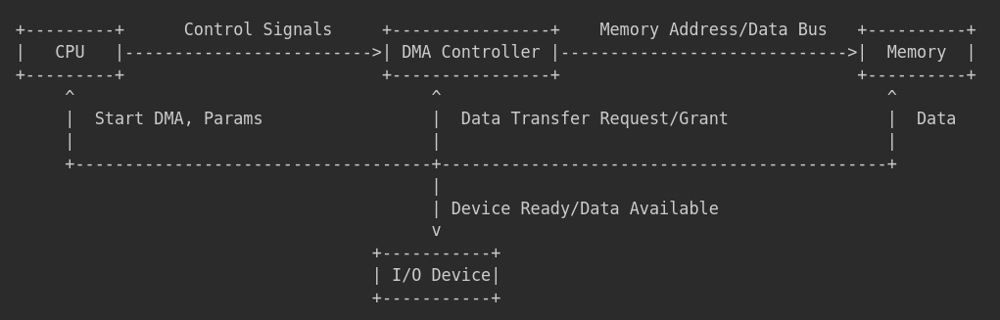

## Section A: Fill in the Blanks

1.  The situation where by only one process use a resource at a time is <u>**mutual exclusion**</u>.
2.  <u>**Hold and wait**</u> is associated with a process holding allocated resources while awaiting assignment of other resources.
3.  <u>**Preemption**</u> has to do with a resource been forcibly removed from a process holding it.
4.  <u>**Circular wait**</u> exist when a closed chain of processes exists such that each process holds at least one resource needed by the next resource in the chain.
5.  An indirect method of deadlock prevention is to prevent the occurrence of one of the following conditions <u>**circular wait**</u>
6.  <u>**Hold and wait**</u>
7.  <u>**No preemption**</u>
8.  <u>**mutual exclusion**</u>
9.  <u>**Deadlock avoidance**</u> is referred to as the strategy of resource allocation denial.
10. Examples of typical scenarios of deadlock are <u>**deadlock in database transactions**</u>.
11. <u>**deadlock in printer spooling systems**</u>.
12. <u>**deadlock in resource allocation in multiprogramming systems**</u>.
13. <u>**Deadlock prevention**</u> is the deadlock approach that leads to inefficient use of resources and inefficient execution of processes.
14. <u>**Deadlock avoidance**</u> is the deadlock approach that requires knowledge of future process resource request.
15. The memory management requirements are <u>**relocation**</u>.
16. <u>**Protection**</u>.
17. <u>**Sharing**</u>.
18. <u>**Logical organization**</u>.
19. <u>**Physical organization**</u>.
20. The file system structure architecture or organization layers are <u>**logical file system**</u>.
21. <u>**File organization module**</u>.
22. <u>**Basic file system**</u>.
23. <u>**I/O control**</u>.
24. <u>**Physical Storage Layer**</u>.
25. <u>**Throughput**</u> and
26. <u>**Turnaround time**</u> are paramount objectives for designing the input and output facility.
27. The disk scheduling policies are <u>**First-Come, First-Served (FCFS)**</u>.
28. <u>**Shortest Seek Time First (SSTF)**</u>.
29. <u>**SCAN (Elevator)**</u>.
30. <u>**C-SCAN (Circular SCAN)**</u>.

## Section B: Answer Any Two Questions From This Section

**1. a. With the aid of diagram explain how a DMA module act as a surrogate processor (10 marks)**

**Diagram:**

**Explanation:**

A DMA (Direct Memory Access) module acts as a "surrogate processor" specifically for handling data transfers between I/O devices and main memory.  Instead of the CPU directly managing each byte of data transfer (as in Programmed I/O or Interrupt-Driven I/O), the DMA controller takes over this task.

1.  **CPU Initiation:** The CPU initiates the DMA transfer by providing the DMA controller with essential information

2.  **DMA Controller Takes Over:** Once initialized, the DMA controller operates independently of the CPU for the duration of the data transfer.

3.  **Completion Notification:** After the entire block of data is transferred (count reaches zero), the DMA controller signals the CPU, typically through an interrupt.

4.  **CPU Resumes:** The CPU, upon receiving the interrupt, knows the DMA transfer is complete and can resume processing, using the data now available in memory (or knowing data has been sent to the device).

**1. b. Is the idea of using a DMA module as a surrogate processor efficient or not. Give reason if your answer is yes, and if No give reason and how it can be improved. (5 marks)**

**Yes, the idea of using a DMA module as a surrogate processor is highly efficient.**

**Reasons for Efficiency:**

*   **Reduced CPU Overhead:** The primary efficiency gain is the significant reduction in CPU involvement during data transfer. The CPU only needs to set up the DMA transfer at the beginning and handle the completion interrupt at the end.  It is free to perform other tasks while the DMA controller handles the data movement.
*   **Faster Data Transfer Rates:** DMA allows for much faster data transfer rates compared to Programmed I/O and Interrupt-Driven I/O. Data transfer speed is limited primarily by the memory and device speeds, not by the CPU's processing speed.
*   **Improved System Throughput:** By freeing up the CPU and speeding up I/O operations, DMA significantly improves overall system throughput and responsiveness.
*   **Efficient for Block Transfers:** DMA is particularly efficient for transferring large blocks of data, which is common in many I/O operations (e.g., disk reads/writes, network data).

**In case, you want to say 'No':**

**Areas for potential improvement:**

*   **Cache Coherency Management:** DMA transfers directly to memory, potentially bypassing the CPU cache.  Improved cache coherency mechanisms (hardware and software) are needed to ensure data consistency between the CPU cache and memory after DMA transfers. Techniques like cache flushing or snooping protocols can be enhanced.
*   **Bus Arbitration Optimization:**  When multiple DMA controllers and the CPU compete for bus access, efficient bus arbitration schemes are crucial to minimize delays and ensure fair resource allocation.  Prioritization and more sophisticated arbitration algorithms can be implemented.
*   **Intelligent DMA Controllers:**  Future DMA controllers could become even more "processor-like" by incorporating features like:
    *   **Scatter-Gather DMA:**  Allowing transfers to/from non-contiguous memory locations, reducing the need for data copying.
    *   **Data Processing Capabilities:**  Simple data processing or filtering during DMA transfer could further offload the CPU.
    *   **Direct Cache Access DMA:** DMA controllers that can directly access the CPU cache could further reduce memory latency.

**1. c. Highlight and explain the two major design objectives of I/O devices. (5 marks)**

Two major design objectives for I/O devices are:

1.  **Efficiency and Performance:** Efficiency is crucial for overall system performance.  Slow I/O devices can become bottlenecks, limiting the speed of applications and the system as a whole.  High-performance I/O devices aim to:
    *   **Maximize Throughput:**  Transfer large amounts of data quickly (measured in MB/s, GB/s, etc.).
    *   **Minimize Latency:**  Reduce the time it takes to initiate and complete an I/O operation (measured in milliseconds, microseconds, etc.).
    *   **Optimize Data Transfer Mechanisms:** Utilize efficient techniques like DMA, buffering, and caching.
    *   **Employ Fast Communication Interfaces:** Use high-speed interfaces like PCIe, USB, SATA, NVMe.

2.  **Generality and Device Independence (Abstraction):** Device independence simplifies application development and improves portability.  Applications should not need to be rewritten or modified significantly when different I/O devices are used.  This is achieved through:
    *   **Operating System Abstraction:** The OS provides a uniform set of system calls and APIs for I/O operations (e.g., `read()`, `write()`, `open()`).
    *   **Device Drivers:** Device drivers act as translators, bridging the gap between the generic OS interface and the specific hardware commands of each device. Drivers encapsulate device-specific details.
    *   **Standard Interfaces and Protocols:**  Using standardized interfaces (e.g., USB, SATA, Ethernet) and communication protocols allows for interoperability and easier integration of diverse devices.
    *   **Plug-and-Play Capability:**  Modern systems aim for plug-and-play, where the OS automatically detects and configures new devices without requiring manual configuration by the user.

**2. a. Highlight and explain the typical operations that can be performed on a file (9 marks)**

Typical operations that can be performed on a file include:

1.  **Create:** This operation creates a new, empty file in the file system. It involves allocating storage space for the file (metadata and potentially data blocks) and adding an entry for the file in the directory structure.

2.  **Write:** This operation writes data to a file. It involves specifying the file, the data to be written, and the position in the file where writing should begin.  The file system updates the file's data blocks on storage.

3.  **Read:** This operation retrieves data from a file. It involves specifying the file, the amount of data to read, and the starting position in the file. The file system reads data from the file's data blocks and makes it available to the requesting process.

4.  **Delete:** This operation removes a file from the file system. It involves removing the file's entry from the directory structure and deallocating the storage space occupied by the file's data blocks and metadata.

5.  **Open:** Before a file can be accessed for reading or writing, it must be opened. This operation prepares the file for access. It involves locating the file in the file system, checking access permissions, and creating a file handle or file descriptor that the process can use for subsequent operations.

6.  **Close:** After a process is finished with a file, it should be closed. This operation releases any resources held by the file system for the file (e.g., file handles, buffers), and ensures that any pending writes are flushed to storage.

7.  **Seek (or Reposition):** This operation changes the current file pointer (or offset) within a file. It allows a process to move to a specific position in the file to read or write data from that point.

8.  **Rename:** This operation changes the name of a file. It involves updating the file's entry in the directory structure to reflect the new name.

9.  **Copy:** This operation creates a duplicate of an existing file. It involves creating a new file and copying the contents of the source file to the new file.

10. **Append:** This operation adds data to the end of an existing file. It is a specialized form of writing where the write position is automatically set to the end of the file.

11. **Get Attributes:** This operation retrieves metadata about a file, such as its size, creation date, modification date, permissions, owner, etc.

12. **Set Attributes:** This operation modifies metadata associated with a file, such as permissions, modification date, etc. (Note: Some attributes like file size are typically managed by the system and not directly settable).

**2. b. State the criteria's that must be considered while choosing a file organization method (2.5 marks)**

1.  **Access Pattern:**  How will the file be accessed? (Sequential, random, a mix?)
2.  **Access Speed:** How quickly must data be accessed? (Performance requirements)
3.  **Storage Efficiency:** How efficiently is storage space utilized? (Minimize wasted space)
4.  **Ease of Implementation:** How complex is the organization method to implement and maintain?
5.  **Reliability and Recoverability:** How robust is the organization against data loss or corruption?
6.  **Scalability:** How well does the organization scale as the file size and number of records grow?
7.  **Security:**  How easily can access control and security be implemented?
8.  **Flexibility:** How adaptable is the organization to changes in data or access patterns?

**2. c. Highlight and explain five methods of file organization (7.5 marks)**

1.  **Sequential File Organization:** Records are stored in a linear sequence, one after another, in the order they were entered. Access is primarily sequential, meaning to access a record in the middle, you must read through all preceding records.
    *   **Advantages:** Simple to implement, efficient for sequential processing (batch processing, backups).
    *   **Disadvantages:** Inefficient for random access, searching for specific records is slow.

2.  **Direct or Random File Organization:** Records can be accessed directly in any order. Each record has a unique key, and the file system uses a mapping (e.g., hashing) to directly locate the storage location of a record based on its key.
    *   **Advantages:** Fast random access, efficient for applications requiring quick retrieval of specific records (databases, online transaction processing).
    *   **Disadvantages:** More complex to implement than sequential, can lead to wasted space if hashing is not well-designed, sequential processing can be less efficient than sequential organization.

3.  **Indexed Sequential File Organization:** Combines sequential and direct access. Records are stored sequentially, but an index is created that maps keys to the location of records (or blocks of records).  Sequential access is efficient, and indexed access allows for reasonably fast random access.
    *   **Advantages:** Good balance between sequential and random access efficiency, suitable for applications needing both types of access.
    *   **Disadvantages:** More complex than sequential, index maintenance overhead, random access is not as fast as pure direct organization.

4.  **Indexed File Organization:** Uses one or more indexes to provide access paths to records. Data records themselves are not necessarily stored in any particular order. Indexes are separate files that contain keys and pointers to the actual data records.
    *   **Advantages:** Very flexible, allows for efficient access based on different keys (multiple indexes), good for complex queries and data retrieval.
    *   **Disadvantages:**  Significant overhead for index maintenance, storage space for indexes, can be complex to manage multiple indexes.

5.  **Hashed File Organization:** A hash function is used to calculate the storage address of a record based on its key. Records are stored and retrieved directly using the hash address.
    *   **Advantages:** Very fast direct access on average, simple to implement for direct access.
    *   **Disadvantages:**  Collisions (different keys hashing to the same address) need to be handled, poor performance for sequential access, range queries are inefficient, file size can be less flexible.

**2. d. State one of the access rights that can be assigned to a particular user (1 marks)**

One access right that can be assigned to a user for a file is **Read access**.

**3. a. i. Differentiate between sequential and concurrent program (10 marks)**

| Feature          | Sequential Program                                  | Concurrent Program                                    |
| ---------------- | ---------------------------------------------------- | ------------------------------------------------------- |
| **Execution Flow** | Single thread of control, tasks executed in order.   | Multiple threads or processes, tasks appear to execute simultaneously. |
| **Task Order**     | Tasks are performed one after another, strictly ordered. | Tasks can be interleaved, overlapped, or truly parallel. |
| **Control Flow**   | Linear, predictable flow of execution.              | Non-linear, control flow can switch between tasks.      |
| **Complexity**     | Simpler to design and debug for single tasks.        | More complex to design, debug, and manage due to synchronization and communication needs. |
| **Parallelism**    | No inherent parallelism.                             | Can exploit parallelism (if hardware supports it) for faster execution. |
| **Responsiveness** | Can be unresponsive if a task is long-running.       | Can be more responsive, as one task can proceed while another is waiting. |
| **Resource Use**   | Typically utilizes resources sequentially.           | Can improve resource utilization by overlapping I/O and computation. |
| **Example**        | Simple script, single-threaded application.          | Web server, multi-threaded game, operating system kernel. |

**3. a. ii. Why is concurrency necessary in computing? (2 marks)**

1.  **Improved Performance (Parallelism):** Concurrency allows programs to utilize multi-core processors or distributed systems to perform tasks in parallel, significantly reducing execution time for computationally intensive tasks.
2.  **Enhanced Responsiveness:** In interactive applications (like GUIs), concurrency prevents the application from becoming unresponsive when performing long operations.  One thread can handle user input while another performs background processing.

**3. b. i. A computer engineer intends incorporating concurrency into the design of his operating system, State four operating system concerns that must be taken into consideration about the existence of concurrency by the engineer. (8 marks)**

1.  **Process/Thread Synchronization:** The OS must provide synchronization primitives like:
    *   **Mutual Exclusion (Locks, Mutexes):** To allow only one thread/process to access a critical section at a time.
    *   **Condition Variables:** To allow threads/processes to wait for specific conditions to become true.
    *   **Semaphores:** To control access to a limited number of resources or to signal events between threads/processes.
    *   **Monitors:** Higher-level synchronization constructs that encapsulate mutual exclusion and condition variables.

2.  **Deadlock and Starvation:** The OS must implement strategies to:
    *   **Deadlock Prevention:** Design the system to eliminate one or more of the deadlock conditions (mutual exclusion, hold and wait, no preemption, circular wait).
    *   **Deadlock Avoidance:** Use algorithms (like Banker's Algorithm) to dynamically allocate resources in a way that avoids deadlock.
    *   **Deadlock Detection and Recovery:** Detect deadlocks when they occur and implement mechanisms to break deadlocks (e.g., process termination, resource preemption).
    *   **Starvation Prevention:** Implement fair scheduling algorithms and resource allocation policies to prevent starvation.

3.  **Process/Thread Communication:** The OS must provide efficient and reliable inter-process communication (IPC) mechanisms:
    *   **Shared Memory:** Allows processes/threads to access a common region of memory for data exchange. Requires careful synchronization.
    *   **Message Passing:** Processes/threads communicate by sending and receiving messages. Can be synchronous or asynchronous.
    *   **Pipes and FIFOs:**  For unidirectional or bidirectional communication between related processes.
    *   **Sockets:** For network-based communication between processes on different machines.

4.  **Resource Management and Scheduling:** The OS must efficiently manage system resources (CPU time, memory, I/O devices) among concurrent processes/threads to ensure fairness, performance, and prevent resource exhaustion.
    *   **CPU Scheduling Algorithms:** Choose appropriate scheduling algorithms (e.g., priority-based, round-robin, multi-level queue) to allocate CPU time fairly and efficiently to concurrent processes/threads.
    *   **Memory Management:**  Manage memory allocation and deallocation for multiple processes/threads, ensuring memory protection and preventing interference.
    *   **I/O Management:**  Schedule and manage I/O requests from concurrent processes/threads to optimize I/O performance and prevent conflicts.
    *   **Resource Limits and Quotas:**  Implement mechanisms to limit resource consumption by individual processes/threads to prevent one process from monopolizing resources and affecting others.