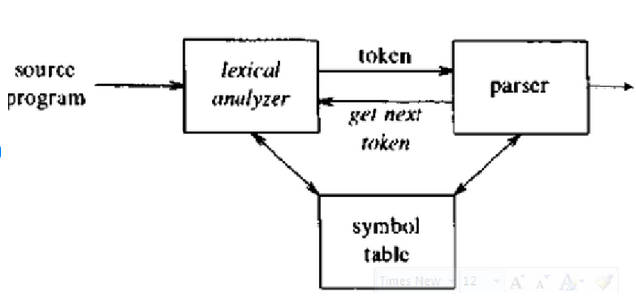

**Question 1**

**(a)**

**(i) Briefly describe the terms parse tree as used in compiler design. (2 mks)**

**Answer:**
A **parse tree** (also called a concrete syntax tree) is a tree representation of the syntactic structure of a string according to some context-free grammar. In compiler design, parse trees are used in the syntax analysis phase to represent how the input source code conforms to the grammar of the programming language.

*   **Purpose in Compiler:** Parse trees visually and structurally demonstrate the grammatical correctness of the source code, making it easier for subsequent compiler phases (like semantic analysis and intermediate code generation) to process the code based on its syntactic structure.

**(ii) List the Phases that constitute the Front End of a compiler. (2½ mks)**

1.  **Lexical Analysis (Scanning):**  Breaks the source code into a stream of tokens.
2.  **Syntax Analysis (Parsing):**  Constructs a parse tree from the tokens, verifying the grammatical structure.
3.  **Semantic Analysis:** Checks the meaning and consistency of the code, performing type checking, scope resolution, etc.
4.  **Intermediate Code Generation:**  Translates the semantically analyzed code into an intermediate representation (IR), which is machine-independent and easier to optimize.

**(iii) Mention the Back-end Phases of a compiler. (2 mks)**

1.  **Code Optimization:**  Improves the intermediate code to enhance performance (speed, memory usage, etc.). This can be machine-independent or machine-dependent.
2.  **Code Generation:**  Translates the optimized intermediate code into the target machine code (assembly language or machine language).

**(b) Derivation using CFG (5 mks)**

**Given CFG:**
S → AB | ε
A → aB
B → Sb

**Derive the string "abb" for leftmost derivation and rightmost derivation.**

**Leftmost Derivation:**

1. **S**
2. **AB**  (S → AB)
3. **aBB** (A → aB)
4. **a(Sb)B** (B -> Sb, using the *first* B)
5. **a(εb)B** (S -> ε, using S in 'Sb')
6. **abB** (Simplifying εb to b)
7. **ab(Sb)** (B -> Sb, using the *second* B)
8. **ab(εb)** (S -> ε, using S in 'Sb')
9. **abb** (Simplifying εb to b)

**Leftmost Derivation: S ⇒ AB ⇒ aBB ⇒ aSbB ⇒ aεbB ⇒ abB ⇒ aSb b ⇒ aεb b ⇒ abb**

**Rightmost Derivation:**

1.  Start with S: **S**
2.  Apply S → AB: **AB** (Rightmost non-terminal is S, applied S → AB)
3.  Apply B → Sb: **ASb** (Rightmost non-terminal is B, applied B → Sb)
4.  Apply S → ε: **Aεb** (Rightmost non-terminal is S, applied S → ε)
5.  Apply A → aB: **aBb** (Rightmost non-terminal is A, applied A → aB)
6.  Apply B → Sb: **aSbb** (Rightmost non-terminal is B, applied B → Sb)
7.  Apply S → ε: **aεbb** (Rightmost non-terminal is S, applied S → ε)
8.  **abb** (Simplifying ε)

**Rightmost Derivation: S ⇒ AB ⇒ ASb ⇒ Aεb ⇒ Ab ⇒ aBb ⇒ aSbb ⇒ aεbb ⇒ abb**


**(c) Operations on Languages (6 mks)**

**Enumerate the operations that can be performed on Languages with example in each.**

1.  **Union (∪):**  The union of two languages L1 and L2, denoted L1 ∪ L2, is the set of all strings that are in L1 or in L2 or in both.
    *   **Example:**  Let L1 = {“a”, “b”} and L2 = {“b”, “c”}.  L1 ∪ L2 = {“a”, “b”, “c”}.

2.  **Intersection (∩):** The intersection of two languages L1 and L2, denoted L1 ∩ L2, is the set of all strings that are in both L1 and L2.
    *   **Example:**  Let L1 = {“a”, “b”} and L2 = {“b”, “c”}. L1 ∩ L2 = {“b”}.

3.  **Concatenation (. or just juxtaposition):** The concatenation of two languages L1 and L2, denoted L1.L2 or L1L2, is the set of all strings formed by taking a string from L1 and concatenating it with a string from L2.
    *   **Example:** Let L1 = {“a”, “b”} and L2 = {“c”, “d”}. L1.L2 = {“ac”, “ad”, “bc”, “bd”}.

4.  **Kleene Closure (Star) (*):** The Kleene closure of a language L, denoted L*, is the set of all strings that can be formed by concatenating zero or more strings from L.  It includes the empty string ε.
    *   **Example:** Let L = {“a”}. L* = {ε, “a”, “aa”, “aaa”, “aaaa”, ...}.

5.  **Positive Closure (+):** The positive closure of a language L, denoted L+, is similar to Kleene closure, but it includes concatenations of *one or more* strings from L. It does *not* include the empty string ε unless ε is in L itself (in which case ε would be in L+).
    *   **Example:** Let L = {“a”}. L+ = {“a”, “aa”, “aaa”, “aaaa”, ...}.

6.  **Set Difference (-):** The set difference of L1 and L2, denoted L1 - L2, is the set of all strings that are in L1 but not in L2.
    *   **Example:** Let L1 = {“a”, “b”, “c”} and L2 = {“b”, “d”}. L1 - L2 = {“a”, “c”}.

7.  **Reversal (<sup>R</sup>):** The reversal of a language L, denoted L<sup>R</sup>, is the set of reversals of all strings in L. If s is a string, s<sup>R</sup> is the reverse of s.
    *   **Example:** Let L = {“ab”, “cd”}. L<sup>R</sup> = {“ba”, “dc”}.


**Question 2**

**(a)**

**(i) Define token as applicable in compilation process. (2½ mk)**

In the compilation process, a **token** is the smallest meaningful unit of a program's syntax. It is a categorized block of text that represents a basic building block of the programming language. Tokens are produced by the lexical analyzer (scanner) from the input character stream.

**(ii) State three example(s) of tokens. (3 mks)**

1.  `IDENTIFIER` = `variableName`, `count`, `myFunction`, `_data`

2.  `INTEGER_LITERAL` = `123`, `0`, `4567`, `-10`

3.  `OPERATOR` = `+`, `-`, `*`, `/`, `=`, `==`, `<`, `>`

4.  `KEYWORD` = `if`, `else`, `while`, `for`, `int`, `float`, `return`

5.  `PUNCTUATION` = `;`, `,`, `(`, `)`, `{`, `}`


**(b)**

**(i) Describe how Lexical Analyzer functions in compilation process. (2 mks)**

The Lexical Analyzer (Scanner) is the first phase of a compiler. Its primary function is to read the source code character by character and group these characters into meaningful sequences called **lexemes**. For each lexeme, it produces a **token**.

*   **Process:**
    1.  **Scanning:** Reads the input character stream.
    2.  **Lexeme Identification:** Identifies lexemes based on predefined patterns (regular expressions).
    3.  **Token Generation:**  For each identified lexeme, it generates a token by associating a token class (type) and the lexeme value.
    4.  **Whitespace and Comment Handling:**  Typically, the lexical analyzer also removes whitespace and comments from the source code as they are generally not needed by subsequent phases.
    5.  **Error Reporting:**  May detect lexical errors like invalid characters or malformed tokens.

**(ii) Highlight the phases of a compiler based on the way they compile. (3½ mks)**

**1. Lexical Analysis (Scanning):  Method: Pattern Matching and Tokenization**

* **Compilation Method:** This phase operates by **scanning** the source code character by character. It uses **pattern matching** techniques, often based on **regular expressions** or **finite automata**, to identify sequences of characters that form meaningful units called **tokens**.

**2. Syntax Analysis (Parsing): Method: Grammar-Based Structure Recognition**

* **Compilation Method:** This phase takes the stream of tokens from the lexical analyzer and **parses** them according to the grammar of the programming language. It uses techniques like **context-free grammars** and parsing algorithms (e.g., top-down like recursive descent, or bottom-up like LR parsing) to build a **parse tree** or an **Abstract Syntax Tree (AST)**.

**3. Semantic Analysis: Method: Rule-Based Meaning and Consistency Checking**

* **Compilation Method:** This phase focuses on the **meaning** (semantics) of the program. It uses **rule-based systems** and **symbol tables** to perform various checks. 

**4. Intermediate Code Generation: Method: Abstraction and Translation**

* **Compilation Method:** This phase translates the semantically analyzed program into an **intermediate representation (IR)**. The IR is a language-independent and machine-independent representation that simplifies further processing (optimization and code generation). Common IR forms include:
    * **Three-Address Code**
    * **Bytecode**
    * **Abstract Syntax Tree (AST) itself (sometimes)**

**5. Optimization: Method: Code Transformation and Improvement**

* **Compilation Method:** This phase aims to improve the intermediate code to enhance performance (speed, memory usage, etc.). It employs various **optimization techniques** based on **program analysis** and **code transformation**.

**6. Code Generation: Method: Target Machine Instruction Selection and Assembly**

* **Compilation Method:** This phase translates the optimized intermediate code into **target machine code** (assembly code or machine instructions) that can be executed by the target processor.

**(c) Write short notes on the following terms as used in compilation process with examples in each: (i) Tokens (ii) Pattern (iii) Lexeme (4½ mks)**

**Answer:**

**(i) Token:** Definition:** A token is a categorized unit of text that represents a basic syntactic building block of a programming language. It is the output of lexical analysis.
*   **Example:**  In the statement `int count = 10;`,  `int` is a token of class `KEYWORD`, `count` is a token of class `IDENTIFIER`, `=` is a token of class `OPERATOR`, `10` is a token of class `INTEGER_LITERAL`, and `;` is a token of class `PUNCTUATION`.

**(ii) Pattern:** A pattern is a rule that describes the set of lexemes that can represent a particular token. Patterns are usually defined using regular expressions.
*   **Example:**
    *   **Pattern for IDENTIFIER:**  `letter (letter | digit)*`  (starts with a letter followed by zero or more letters or digits). Lexemes like `x`, `count`, `myVar123` match this pattern.
    *   **Pattern for INTEGER_LITERAL:** `digit+` (one or more digits). Lexemes like `0`, `123`, `999` match this pattern.

**(iii) Lexeme:** A lexeme is the actual sequence of characters in the source code that matches the pattern for a token. It is the "instance" of a token in the source code.
*   **Example:**  In the statement `if (x > 5) { ... }`,
    *   `if` is a lexeme that corresponds to the `KEYWORD` token.
    *   `(` is a lexeme for the `PUNCTUATION` token.
    *   `x` is a lexeme for the `IDENTIFIER` token.
    *   `>` is a lexeme for the `OPERATOR` token.
    *   `5` is a lexeme for the `INTEGER_LITERAL` token.
    *   `)` is a lexeme for the `PUNCTUATION` token.
    *   `{` is a lexeme for the `PUNCTUATION` token.


**Question 3**

**(a) Outline the benefits of Intermediate Code Generation in compiler structure? (4½ mks)**

1.  **Machine Independence:** IR is designed to be machine-independent. This allows the front-end of the compiler to be independent of the target machine architecture.  The same front-end can be used for different back-ends targeting different architectures, simply by changing the back-end phases (code optimization and code generation).

2.  **Portability:** Compilers become more portable. To port a compiler to a new machine, only the back-end needs to be rewritten or modified, as the front-end (up to IR generation) remains the same.

3.  **Optimization Facilitation:** IR provides a good level for performing machine-independent optimizations. Optimizations at the IR level are generally more effective and easier to implement than directly optimizing source code or machine code. Common optimizations include constant folding, dead code elimination, common subexpression elimination, etc.

4.  **Simplified Back-End Design:**  The back-end becomes simpler because it works from a relatively high-level, machine-independent IR rather than directly from the complex source code or parse tree. This modularity simplifies compiler development and maintenance.

5.  **Language Independence (to some extent):**  If multiple source languages compile to the same IR, a single back-end can be used for all of them. This concept is seen in systems like .NET CLR (Common Language Runtime) and JVM (Java Virtual Machine), where different languages (C#, VB.NET, Java, Scala, etc.) compile to a common bytecode (IR).

**(b) Finite Automata for Regular Expressions (5 mks)**

**State the mathematical model composition of finite automata as a recognizer for regular expressions. (5 mks)**

**Answer:**
A Finite Automaton (FA) is a mathematical model of computation used to recognize regular languages, which are precisely the languages that can be described by regular expressions. A Finite Automaton is formally defined as a 5-tuple:

**M = (Q, Σ, δ, q<sub>0</sub>, F)**

Where:

1.  **Q:** A finite set of **states**. These are the different configurations the automaton can be in during its operation.

2.  **Σ:** A finite set of **input symbols**, called the **alphabet**. These are the symbols that the automaton can read as input.

3.  **δ:** The **transition function**. This function takes a state and an input symbol as arguments and returns the next state.  δ: Q × Σ → Q (for Deterministic Finite Automaton - DFA). For Non-deterministic Finite Automaton (NFA), δ: Q × Σ → P(Q) where P(Q) is the power set of Q (set of subsets of Q).  This means for an NFA, from a state on an input symbol, it can transition to a *set* of possible next states.

4.  **q<sub>0</sub>:** The **start state**. This is the state in which the automaton begins processing the input. q<sub>0</sub> ∈ Q.

5.  **F:** A set of **accept states** (or final states). These are the states that, if reached after processing the entire input string, indicate that the string is accepted by the automaton (i.e., it belongs to the language recognized by the automaton). F ⊆ Q.

**(c)**

**(i) Briefly explain the main functions of Syntax Analysis stage of a compiler? (2½ mks)**

1.  **Grammatical Structure Verification:**  To check if the sequence of tokens from the lexical analyzer conforms to the grammatical rules of the programming language. It does this by building a parse tree or syntax tree.

2.  **Parse Tree/Syntax Tree Construction:** To construct a hierarchical representation of the program's syntactic structure. The parse tree explicitly shows how the input program is derived from the grammar. An Abstract Syntax Tree (AST) is a more condensed form of the parse tree, removing unnecessary details.

3.  **Syntax Error Detection and Reporting:** To identify and report syntax errors in the source code. If the token stream does not conform to the grammar, the parser detects the error, provides informative error messages (line number, type of error, expected token, etc.), and often attempts error recovery to continue parsing and find more errors.

4.  **Preparation for Semantic Analysis:** The output of syntax analysis (parse tree or AST) serves as the input for the semantic analysis phase. It provides a structured representation that semantic analysis can use to check for meaning and consistency.


**(ii) What are the classifications of a compiler? (2½ mks)**

1.  **Based on the number of passes:**
    *   **Single-pass compiler:** Performs all phases of compilation in a single pass over the source code.
    *   **Two-pass compiler:** Makes two passes over the source code.
    *   **Multi-pass compiler:** Makes multiple passes over the source code or intermediate representations. Each pass can focus on a specific task (e.g., one pass for syntax analysis, another for semantic analysis, several passes for different levels of optimization).

2.  **Based on the target machine:**
    *   Native compiler (target is the same type of machine as the compiler runs on)
    *   Cross-compiler (target is a different type of machine)

3.  **Based on the output:**
    *   Compiler to machine code (generates executable machine code)
    *   Compiler to assembly code (generates assembly language code)
    *   Compiler to bytecode (generates bytecode for a virtual machine, e.g., Java, .NET)
    *   Source-to-source compiler (transpiler) (translates from one high-level language to another, e.g., TypeScript to JavaScript)

4.  **Based on optimization level:**
    *   Non-optimizing compiler
    *   Optimizing compiler (can be further classified based on types of optimizations: local, global, inter-procedural, etc.)

5.  **Based on implementation language:**
    *   Self-hosting compiler (written in the language it compiles)
    *   Bootstrapping compiler (used to compile itself or a later version of itself)

6.  **Based on the compilation process:**
    *   Just-in-Time (JIT) compiler (compiles code during runtime, often used in virtual machines)
    *   Ahead-of-Time (AOT) compiler (compiles code before runtime)


**(iii) Distinguish between SLR(1) and LR(0) as used in compiler design. (3 mks)**

| Feature             | LR(0) Parser                                   | SLR(1) Parser                                      |
|----------------------|-------------------------------------------------|----------------------------------------------------|
| **Parsing Power**   | Weakest in LR family. Can handle only very simple grammars (deterministic context-free grammars with limited lookahead needs). | Stronger than LR(0). Can handle a larger class of grammars, including many grammars that are not LR(0). |
| **Lookahead**       | No lookahead. Decisions are made solely based on the stack content.                                 | Uses 1-symbol lookahead. Uses FOLLOW sets to resolve reduce-reduce and shift-reduce conflicts. |
| **Conflict Resolution** | Suffers from shift-reduce and reduce-reduce conflicts more often.                                | Resolves some conflicts that LR(0) cannot by using FOLLOW sets to determine when to perform a reduction. |
| **Construction**    | Simple to construct.                               | Slightly more complex than LR(0) due to the use of FOLLOW sets. |
| **Parsing Table Size**| Can be smaller than SLR(1) for some grammars, but typically parsing power is the limiting factor. | Can be larger than LR(0) due to the added complexity in handling lookahead. |
| **Applicability**    | Rarely used in practice for real programming languages due to its limitations. More of a theoretical concept to understand LR parsing. | More practical than LR(0). Can handle many programming language constructs. Still less powerful than LALR(1) and LR(1). |
| **Conflict Condition** | LR(0) item sets with shift and reduce items, or multiple reduce items, always cause conflicts.        | SLR(1) resolves conflicts if reduce action and shift action (or different reduce actions) are based on disjoint lookahead sets (using FOLLOW sets). |

**Question 4**

**(a)**

**(i) Briefly describe the terms "three address code" in compiler design? (2 mks)**

**Answer:**
**Three-Address Code (TAC)** is a form of intermediate representation (IR) used in compilers. It is designed to be simple, machine-independent, and easy to optimize.

*   **Instruction Format:**  Each TAC instruction typically has at most three addresses (operands): two for sources and one for the result.
*   **General Form:** `result = operand1 operator operand2`  or similar variations like unary operations or assignments.
*   **Temporary Variables:** TAC often uses temporary variables (temporaries) to store intermediate results. These temporaries are compiler-generated and are typically unlimited in number.
*   **Types of Instructions:** Common TAC instructions include:
    *   Assignments (e.g., `x = y op z`, `x = op y`, `x = y`)
    *   Arithmetic operations (+, -, *, /, etc.)
    *   Logical operations (AND, OR, NOT)
    *   Data transfer (move, load, store)
    *   Conditional and unconditional jumps (branching, gotos)
    *   Procedure calls and returns

*   **Example:**  Consider the expression `a = b * c + d`.  In TAC, this might be represented as:
    ```
    t1 = b * c   // t1 is a temporary variable
    a = t1 + d
    ```

**(ii) Consider the following grammar: S → aS  S → Sb  S → b. What kind of grammar is this in the Chomsky hierarchy? (2½ mks)**

**Answer:**
Given grammar rules are:
1.  S → aS
2.  S → Sb
3.  S → b

Let's analyze it based on Chomsky Hierarchy:

*   **Type 0 (Unrestricted Grammar):**  No restrictions. All grammars are Type 0. This grammar is definitely Type 0.
*   **Type 1 (Context-Sensitive Grammar):** Rules are of the form α → β, where β is at least as long as α (except possibly for the rule S → ε if S is not on the RHS of any rule). In our grammar, all rules are of the form non-terminal → (terminal or non-terminal) sequence. The length of RHS is always greater than or equal to LHS. It looks like it *could* be context-sensitive. Let's check further.
*   **Type 2 (Context-Free Grammar):** Rules are of the form A → α, where A is a non-terminal and α is a string of terminals and/or non-terminals. All rules in our grammar are of this form (S is a non-terminal, and RHS are strings of terminals and non-terminals). Thus, it is a Context-Free Grammar.
*   **Type 3 (Regular Grammar):** Rules are of the form A → aB or A → a or A → ε (right-regular) or A → Ba or A → a or A → ε (left-regular), where A, B are non-terminals and 'a' is a terminal.
    *   Rule 1: S → aS -  Fits right-regular form (A → aB).
    *   Rule 2: S → Sb - Does *not* fit right-regular form. It is left-recursive if you consider direction of derivation, but in terms of rule form, it's not A → aB or A → a or A → ε.  However, if we consider *left-regular* grammar definition A → Ba, it could fit, but terminal 'b' is on the right.
    *   Rule 3: S → b - Fits right-regular form (A → a) and also left-regular form (A → a).

**(b) Components of Context-Free Grammar (6 mks)**

**What are the components of a context-free grammar? (6 mks)**

**Answer:**
A Context-Free Grammar (CFG) is a formal grammar used to describe the syntax of programming languages. It is defined by a 4-tuple:

**G = (V, T, P, S)**

Where:

1.  **V:** A finite set of **non-terminal symbols** (or variables). These are syntactic categories or placeholders that represent sets of strings. They are often written in uppercase letters or enclosed in angle brackets (e.g., {S, A, B, Expression, Statement}).

2.  **T:** A finite set of **terminal symbols**. These are the basic symbols of the language being defined. They are the tokens produced by the lexical analyzer. They are often lowercase letters, digits, operators, or keywords (e.g., {a, b, c, 0, 1, +, *, if, else}). V and T are disjoint sets (V ∩ T = ∅).

3.  **P:** A finite set of **production rules** (or productions). Each production rule is of the form  A → α, where A is a non-terminal symbol (A ∈ V) and α is a string of symbols from (V ∪ T)*, meaning α can be composed of terminals and/or non-terminals (or be an empty string ε).  Productions define how non-terminals can be replaced by other symbols.

4.  **S:** The **start symbol**. This is a special non-terminal symbol (S ∈ V) that represents the root of the grammar and the starting point for derivations.  It represents the overall syntactic category (e.g., "Program", "Sentence", "Expression").


**(c) Syntax Analyzer Drawbacks & Cross-Compiler (4 + 3 mks)**

**(i) Outline the drawbacks in Syntax analyzers (4 mks)**

**Answer:**
While syntax analyzers (parsers) are crucial for compilation, they have some drawbacks:

1.  **Limited Scope of Error Detection:** Syntax analyzers primarily focus on *syntactic* correctness (grammar rules). They do not detect *semantic* errors (meaning errors) or logical errors. For example, type errors, undeclared variables, incorrect use of variables (semantic issues) are not caught by the parser.  Similarly, logical errors like infinite loops or incorrect algorithm logic are beyond the scope of syntax analysis.

2.  **Complexity for Ambiguous Grammars:**  If the programming language grammar is ambiguous (meaning a string can have more than one parse tree), designing and implementing a parser becomes more complex. Parsers for ambiguous grammars are often more difficult to construct and may lead to unpredictable behavior if not handled carefully.  Ideally, programming language grammars should be designed to be unambiguous or handled with disambiguation rules.

3.  **Performance Overhead:** Parsing can be a computationally intensive phase, especially for complex grammars and large source files. While efficient parsing algorithms exist (like LR parsing), parsing still adds overhead to the compilation process.

4.  **Grammar Design Dependency:** The effectiveness of a syntax analyzer heavily depends on the quality of the grammar. A poorly designed grammar can be ambiguous, difficult to parse, or not accurately represent the language's intended syntax, leading to parser limitations and potential issues in language processing.

5.  **Error Recovery Challenges:**  When a syntax error is detected, a parser needs to perform error recovery to continue parsing and find more errors. Designing effective error recovery mechanisms is challenging. Simple approaches might lead to cascading errors or miss subsequent errors. Sophisticated error recovery techniques can be complex to implement and may still not always produce the desired behavior in all error scenarios.

**(ii) The cross-compiler is used to implement the compiler, characterized by three languages, state these three languages (3 mks)**

**Answer:**
A **cross-compiler** is a compiler that runs on one type of machine (the *host machine*) and generates executable code for a different type of machine (the *target machine*).  When discussing the languages involved in cross-compilation, we typically consider three:

1.  **Source Language:** This is the programming language that the programmer writes in. The cross-compiler takes source code written in this language as input.  Example: C, C++, Java.

2.  **Implementation Language (or Compiler Writing Language):** This is the language in which the cross-compiler itself is written. The compiler program is coded in this language. Example: C, C++, Go, Java, Assembly.

3.  **Target Language:** This is the language that the cross-compiler outputs. In the context of a compiler, the target language is usually machine code or assembly language for the target machine architecture. Example: Assembly language for ARM architecture, machine code for x86 architecture.

**Example Scenario:**  Imagine you are developing software for an embedded system with an ARM processor, but your development machine is an x86-based PC. You would use a cross-compiler that:

*   **Runs on your x86 PC** (Host Machine).
*   **Is written in, say, C++** (Implementation Language).
*   **Takes your C source code as input** (Source Language).
*   **Generates ARM machine code as output** (Target Language), which can then be deployed and run on the ARM-based embedded system.


**Question 5**

**(a) Shift-Reduce Parsing & Lexical Analysis Implementation (3 + 3 mks)**

**(i) Shift-reduce parsing uses two unique steps for bottom-up parsing, briefly explain these steps (3 mks)**

**Answer:**
Shift-reduce parsing is a type of bottom-up parsing. It attempts to construct a parse tree for an input string by starting from the leaves (tokens) and working its way up to the root (start symbol). It uses two main actions:

1.  **Shift:**
    *   **Action:**  Read the next input symbol (token) from the input stream and push it onto the parsing stack.
    *   **Purpose:** Moves input symbols onto the stack to be processed later for potential reductions.
    *   **Stack State Change:** Increases the stack size by one. Input stream pointer advances to the next token.

2.  **Reduce:**
    *   **Action:**  Recognize that the top of the stack matches the right-hand side (RHS) of a grammar production rule. Pop the symbols corresponding to the RHS from the stack and push the non-terminal on the left-hand side (LHS) of the production onto the stack.
    *   **Purpose:**  Combines a sequence of symbols on the stack that form a handle (reducible to a non-terminal) according to a grammar rule, effectively reversing a derivation step.
    *   **Stack State Change:** Decreases the stack size (by the length of RHS) and then increases it by one (for the LHS non-terminal). Input stream pointer remains unchanged.

**Parsing Process:** Shift-reduce parsing operates by repeatedly performing shift and reduce actions until the entire input string is processed and the stack contains only the start symbol, indicating successful parsing. If at any point, neither a shift nor a reduce action is possible, and the stack does not contain only the start symbol, then a syntax error is detected.

**(ii) What are the common ways to implement a lexical analysis in a finite state machine design (3 mks)**

**Answer:**
Lexical analysis is commonly implemented using Finite State Machines (FSMs) or Finite Automata (FAs). Here are common ways to design and implement a lexical analyzer using FSMs:

1.  **Regular Expressions to NFAs/DFAs:**
    *   **Process:** Define patterns for each token type using regular expressions. Convert these regular expressions into Non-deterministic Finite Automata (NFAs) and then convert NFAs to Deterministic Finite Automata (DFAs).
    *   **Implementation:** Each state in the DFA represents a state in the lexical analysis process. Transitions are based on input characters. Accept states are associated with token types. When the DFA reaches an accept state, a token is recognized.
    *   **Tools:** Tools like Lex (Flex) automate this process. They take regular expression specifications as input and generate C/C++ code for a lexical analyzer based on DFA implementation.

2.  **Hand-Coded DFA:**
    *   **Process:** Manually design a DFA based on the language's token specifications.  Draw state diagrams and define transition tables.
    *   **Implementation:** Implement the DFA directly in code (e.g., using nested `switch` statements or a state transition table data structure).  The code reads input characters, updates the current state based on transitions, and recognizes tokens when reaching accept states.
    *   **Control Flow:**  Typically involves a loop that reads characters and state variables to track the current lexical state.

3.  **Table-Driven Lexical Analyzer:**
    *   **Process:**  Represent the DFA as a transition table (a 2D array where rows are states, columns are input symbols, and entries are next states). Also, create an action table to specify actions (e.g., token recognition, error handling) for each state.
    *   **Implementation:** Write a generic lexical analyzer engine that uses the transition and action tables to process input. The engine reads input characters, looks up transitions in the table, updates the state, and performs actions based on the action table.
    *   **Flexibility:**  Changes to token definitions (regular expressions) require only updating the tables, not rewriting the core lexical analyzer engine.

4.  **Scanner Generators (e.g., Lex/Flex):**
    *   **Process:** Use a scanner generator tool. Provide regular expressions for each token type and associated actions (code to be executed when a token is recognized).
    *   **Implementation:** The scanner generator automatically generates the lexical analyzer code (typically in C or C++), which is usually based on an optimized DFA implementation.
    *   **Efficiency and Ease of Use:** Scanner generators are highly efficient and simplify lexical analyzer development. They handle DFA construction, minimization, and code generation automatically.


**(b) LR Parser Algorithms & Lexical Analyzer Generator (6 + 3½ mks)**

**(i) Briefly describe the three widely used algorithms available for constructing an LR parser (6 mks)**

**Answer:**
LR parsers are powerful bottom-up parsers. Three widely used algorithms for constructing LR parsing tables are:

1.  **LR(0) Parser Construction:**
    *   **Algorithm:** Based on LR(0) items (grammar rules with a dot indicating the current position). Constructs sets of LR(0) items (item sets or states) using closure and goto operations. Builds a DFA of item sets. Creates parsing tables (action and goto tables) based on transitions and item sets.
    *   **Parsing Power:** Weakest of the LR family. Can only handle grammars that are LR(0), meaning no shift-reduce or reduce-reduce conflicts in any state of the LR(0) automaton.
    *   **Limitation:**  Often insufficient for practical programming language grammars due to frequent conflicts.
    *   **Conceptual Foundation:**  Fundamental for understanding other LR parsing techniques.

2.  **SLR(1) (Simple LR) Parser Construction:**
    *   **Algorithm:**  Similar to LR(0) in constructing item sets and DFA.  Differs in how conflicts are resolved. For reduce actions, SLR(1) uses 1-symbol lookahead and FOLLOW sets. A reduce action for a rule A → α is performed only if the next input token is in the FOLLOW set of A.
    *   **Parsing Power:** More powerful than LR(0). Resolves many LR(0) conflicts by using lookahead. Can handle a larger class of grammars.
    *   **Conflict Resolution:** Uses FOLLOW sets to distinguish between shift and reduce or between different reduce actions.
    *   **Practicality:**  More practical than LR(0), but still limited in handling some grammars.

3.  **LALR(1) (Look-Ahead LR) Parser Construction:**
    *   **Algorithm:**  Similar to LR(1), but optimizes the number of states. LR(1) parsers can have a very large number of states. LALR(1) reduces the number of states by merging LR(1) states that have the same core (grammar rules and dot positions) but may differ in lookahead sets.  After merging, lookahead sets are combined.
    *   **Parsing Power:**  Almost as powerful as LR(1) in practice, but with significantly fewer states.  Can handle most practical programming language grammars.
    *   **State Reduction:** Merges LR(1) states to reduce table size. May introduce reduce-reduce conflicts that were not present in LR(1), but this is rare in typical programming language grammars.
    *   **Practicality:**  Most widely used LR parser construction technique in practice (e.g., used by Yacc/Bison parser generators). Good balance of parsing power and table size.

**LR(1) Parser Construction (For completeness, although not explicitly asked to describe three *widely used* algorithms, LALR(1) is derived from LR(1)):**

*   **LR(1) Parser Construction:**
    *   **Algorithm:**  Uses LR(1) items, which are LR(0) items augmented with a lookahead symbol. An LR(1) item is of the form [A → α.β, a], where 'a' is a lookahead terminal. Item sets and DFA are constructed considering both the rule and the lookahead. Parsing table entries are determined based on both item sets and lookahead symbols.
    *   **Parsing Power:** Most powerful of the simple LR family (LR(0), SLR(1), LALR(1), LR(1)). Can handle the largest class of deterministic context-free grammars (LR(1) grammars).
    *   **State Explosion:**  Can result in a very large number of states in the LR(1) automaton and parsing table, which can be a practical limitation.
    *   **Theoretical Significance:**  Represents the full power of deterministic context-free parsing.

**(ii) With the aid of relevant diagram only, describe the lexical analyzer generator (3½ mks)**



**(c) Pass vs Phase in Compiler Design (2 mks)**

**Differentiate between Pass and Phase in compiler design (2 mks)**

**Answer:**

| Feature           | Phase                                      | Pass                                         |
|--------------------|---------------------------------------------|----------------------------------------------|
| **Definition**     | A logically distinct stage in the compilation process. Performs a specific task. | A complete traversal of the source code or intermediate representation by the compiler. |
| **Examples (Phases)**| Lexical Analysis, Syntax Analysis, Semantic Analysis, Intermediate Code Generation, Code Optimization, Code Generation. | Pass 1 (Front-end analysis), Pass 2 (Back-end synthesis), etc. |
| **Relationship**   | A compiler is structured into phases.       | A pass can involve one or more phases.  Phases are organized into passes. |

**Question 6**

**(a) Noam Chomsky Classification (5½ mks)**

**In tabular form, explain Noam Chomsky classification of four classes of languages using (5½ mks)**

**(i) Type of Grammar (ii) Restriction on G=(N,T,P,S) (iii) Advantages and Disadvantages**

**Answer:**

| Type (Level) | Grammar Type           | Restrictions on Productions (P)                                      | Advantages                                                                    | Disadvantages                                                                     |
|--------------|-------------------------|----------------------------------------------------------------------|---------------------------------------------------------------------------------|---------------------------------------------------------------------------------|
| **Type-0**   | Unrestricted Grammar   | No restrictions on production rules. Rules are of the form α → β, where α, β are any strings of terminals and non-terminals, and α must contain at least one non-terminal. | Most general grammar. Can describe any recursively enumerable language.  | Very complex to parse and analyze. Not typically used for programming languages. |
| **Type-1**   | Context-Sensitive Grammar (CSG) | Rules of the form αAβ → αγβ, where A ∈ N, α, β, γ ∈ (N ∪ T)* and γ is not null, or rules of the form S → ε if ε is in L(G).  Essentially, rules are of the form α → β where |α| ≤ |β|, except possibly S → ε. | More powerful than context-free grammars. Can describe some aspects of natural languages and situations where context matters. | Difficult to parse algorithmically. Less practical for compiler design than CFGs. Parsing algorithms are complex and less efficient. |
| **Type-2**   | Context-Free Grammar (CFG)   | Rules of the form A → α, where A ∈ N and α ∈ (N ∪ T)*. Only a single non-terminal on the LHS. | Simple and efficient parsing algorithms exist (e.g., LR parsing). Well-suited for describing the syntax of programming languages. Relatively easy to design and understand. | Cannot describe all aspects of programming language syntax (e.g., context-sensitive features like variable declaration before use in some strict senses). Less powerful than CSGs. |
| **Type-3**   | Regular Grammar        | Right-Regular: Rules of the form A → aB, A → a, A → ε. Left-Regular: Rules of the form A → Ba, A → a, A → ε. A, B ∈ N, a ∈ T. | Simplest grammars. Efficient recognition using finite automata. Used for lexical analysis (tokenization) and simple pattern matching. | Least powerful. Cannot describe nested structures or complex syntax. Not sufficient for the full syntax of most programming languages. |


**(b) Parser Error Recovery & Derivation (4 + 4 mks)**

**(i) Enumerate the four common error-recovery strategies that can be implemented in the parser to deal with errors in the code (4 mks)**

1.  **Panic Mode Recovery:**
    *   **Strategy:** When an error is detected, the parser discards input tokens one at a time until it reaches a synchronizing token (e.g., semicolon, keyword like `end`, `}`).

2.  **Phrase-Level Recovery:**
    *   **Strategy:** When an error is detected, the parser attempts to correct the error locally. It might replace a prefix of the remaining input with a string that allows parsing to continue. Correction might involve inserting, deleting, or replacing tokens.

3.  **Error Productions:**
    *   **Strategy:** Augment the grammar with specific production rules that generate erroneous constructs. When an error is encountered, these error productions can be used in parsing, effectively "handling" the error as part of the grammar.

4.  **Global Correction:**
    *   **Strategy:**  The parser attempts to find a minimally changed program that is syntactically correct. This is typically done using dynamic programming or other global optimization techniques to find the "closest" correct program to the erroneous input.

**(ii) Derive the string "aabbabba" for leftmost and rightmost derivation using a CFG given by, (4 mks)**

**Given CFG:**
S → ab | bA
A → aS | bA | aBB
B → b | aB | aBB

**I could nto solve this completely, maybe there is an issue with the question faa.**

**(c) Regular Expressions: Union & Kleene Closure (4 mks)**

**If r and s are regular expressions denoting the languages L(r) and L(s), state the expression for the following notations: (i) Union (ii) Kleene closure (4 mks)**

**Answer:**

**(i) Union:**
*   **Notation:**  L(r) ∪ L(s)
*   **Regular Expression:** `r | s`  (or `r + s` in some notations, but `|` is more standard for union in regular expressions like in Lex/Flex, Regex).
*   **Explanation:** The regular expression `r | s` denotes the language that is the union of the languages denoted by `r` and `s`. It matches any string that matches either the pattern `r` or the pattern `s` (or both).

**(ii) Kleene Closure:**
*   **Notation:** (L(r))<sup>*</sup>
*   **Regular Expression:** `r*`
*   **Explanation:** The regular expression `r*` denotes the Kleene closure of the language denoted by `r`. It matches any string that is formed by concatenating zero or more strings, each of which matches the pattern `r`. This includes the empty string ε (when zero strings are concatenated).

**Example:**
Let r be the regular expression `a` (language L(r) = {“a”}) and s be the regular expression `b` (language L(s) = {“b”}).

*   **Union:** `r | s` is `a | b`.  Language L(a | b) = {“a”, “b”}.
*   **Kleene Closure of r:** `r*` is `a*`. Language L(a*) = {ε, “a”, “aa”, “aaa”, ...}.
*   **Kleene Closure of s:** `s*` is `b*`. Language L(b*) = {ε, “b”, “bb”, “bbb”, ...}.