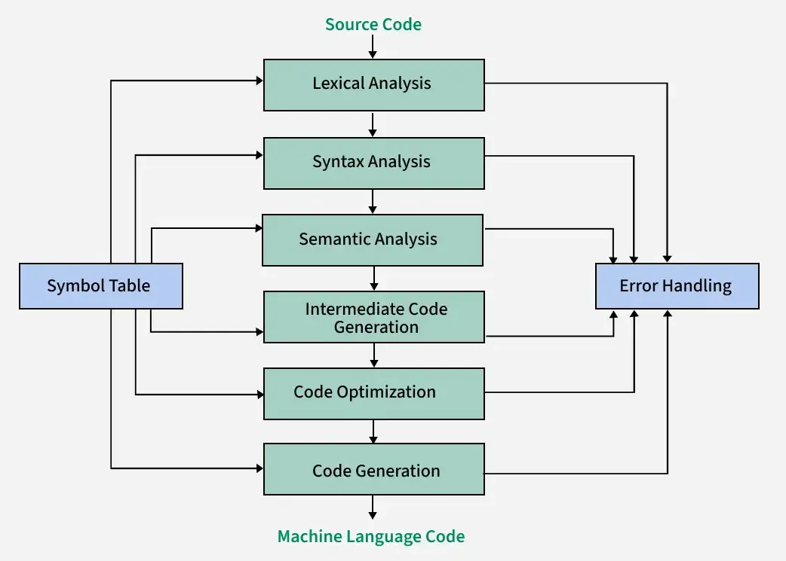

**Question 1**

**(a) With the aid of a block diagram, explain the term compiler. (8 marks)**



**(b) Explain each of the following parts of compilation: (i) Analysis part (ii) Synthesis part. (1.5 + 2 marks)**

**(i) Analysis Part (or Front End): (1.5 marks)**

The **Analysis Part** (or Front End) of a compiler is responsible for breaking down the source program into its constituent parts and creating an intermediate representation. It focuses on understanding the source code. The main phases in the analysis part are:

*   **Lexical Analysis:**  Breaks the source code into tokens.
*   **Syntax Analysis:** Constructs a parse tree to verify grammatical structure.
*   **Semantic Analysis:** Checks for meaning and consistency of the program.
*   **Intermediate Code Generation:** Translates the analyzed code into an intermediate representation.

The analysis part is largely **machine-independent**, meaning it is not significantly affected by the target machine architecture. It's primarily concerned with understanding the source language.

**(ii) Synthesis Part (or Back End): (2 marks)**

The **Synthesis Part** (or Back End) of a compiler is responsible for constructing the target program from the intermediate representation produced by the analysis part. It focuses on generating the executable code. The main phases in the synthesis part are:

*   **Intermediate Code Optimization:** Improves the intermediate code for efficiency.
*   **Code Generation:** Translates the optimized intermediate code into the target machine code.

The synthesis part is **machine-dependent**. It is tailored to the specific target machine architecture for which the compiler is generating code. This part handles aspects like register allocation, instruction selection, and machine-specific optimizations.


**(c) Discuss your knowledge of each of the following: (i) Lexical structure level of a program. (ii) Syntactic structure level of a program. (3 marks x 2 = 6 marks)**

**(i) Lexical Structure Level of a Program (3 marks)**

The **lexical structure level** is the most basic level of program structure. It deals with the individual characters and how they are grouped into meaningful units called **tokens**.

*   **Characters:**  The fundamental building blocks are characters from the source character set (e.g., ASCII, Unicode).
*   **Lexemes:** Sequences of characters that form a meaningful unit, like keywords (`if`, `while`), identifiers (`variableName`), operators (`+`, `=`), literals (`123`, `"hello"`), and punctuation (`;`, `(`).
*   **Tokens:**  Categories assigned to lexemes. A token has a token type (e.g., `KEYWORD`, `IDENTIFIER`, `OPERATOR`, `INTEGER_LITERAL`) and optionally a token value (the lexeme itself or a pointer to it).
*   **Patterns:** Regular expressions are used to define the patterns for recognizing different types of lexemes.
*   **Lexical Analyzer's Role:** The lexical analyzer (scanner) is responsible for reading the source code, identifying lexemes based on patterns, and producing a stream of tokens. It essentially converts the character stream into a token stream, which is the input for the next phase (syntax analysis).

**(ii) Syntactic Structure Level of a Program (3 marks)**

The **syntactic structure level** describes how tokens are arranged to form grammatically correct phrases and statements in a program. It defines the rules for combining tokens in a valid way according to the programming language's grammar.

*   **Grammar:**  Context-Free Grammars (CFGs) are used to formally define the syntax of a programming language. Grammars consist of rules (productions) that specify how non-terminal symbols (representing syntactic categories like `Expression`, `Statement`) can be derived into sequences of terminals (tokens) and other non-terminals.
*   **Parse Trees (Syntax Trees):**  These are hierarchical tree structures that represent the syntactic structure of a program according to the grammar. They show how the program's constructs are formed from tokens and grammar rules.
*   **Syntax Analyzer's Role:** The syntax analyzer (parser) takes the token stream from the lexical analyzer and checks if it conforms to the language's grammar. It constructs a parse tree or an abstract syntax tree (AST) if the input is syntactically correct. If not, it reports syntax errors. Parsers use algorithms like top-down or bottom-up parsing to perform this analysis. The syntactic structure ensures that the program is well-formed according to the language's rules, regardless of its meaning.

**Question 2**

**(a) State five (5) problems with the machine language programming. (5 marks)**

1.  **Difficult to Read and Understand:** Machine code is a sequence of binary or hexadecimal instructions that are very cryptic and hard for humans to read and comprehend. It lacks any mnemonic or descriptive names, making it almost impossible to understand the logic directly.

2.  **Difficult to Write and Maintain:** Writing machine code is tedious and error-prone. Programmers must remember numerical operation codes, memory addresses, and register numbers. Even small programs can become long and complex, making maintenance and modification extremely difficult.

3.  **Machine Dependent:** Machine language is specific to a particular computer architecture (CPU type). Code written for one type of machine will not run on another. This lack of portability means programs need to be rewritten entirely for different architectures.

4.  **Time-Consuming and Laborious:**  Developing programs in machine language is a very slow and laborious process. Programmers have to deal with low-level details and perform tasks manually that are automated in higher-level languages, significantly increasing development time.

5.  **Error-Prone and Difficult to Debug:** Due to the complexity and lack of readability, machine language programs are highly prone to errors. Debugging is extremely challenging as identifying and fixing errors in long sequences of numerical codes is very difficult and time-consuming. Error messages are non-existent or very basic.


**(b) Describe, using diagram, the translator of software program. (2.5 marks)**

**Answer:**

```
+---------------------+     Source Program     +----------------+
| High-Level Language | ---------------------> | Translator     | ----> Target Program
| (e.g., C, Python)   |                        | (Compiler or   |       (e.g., Machine Code,
+---------------------+                        |  Interpreter)  |        Bytecode)
                                               +----------------+
```

**Explanation:**

A **translator** is a program that takes a program written in one programming language (the **source language**) and converts it into an equivalent program in another programming language (the **target language**). This is essential because computers can directly execute only machine code. Software programs are typically written in high-level languages to make programming easier for humans. The translator bridges this gap.

*   **Source Program:** The program written by a programmer in a high-level language (like C, Java, Python, etc.).
*   **Translator:**  The program that performs the translation. This can be either a **compiler** or an **interpreter**.
    *   **Compiler:** Translates the entire source program into a target program (e.g., machine code) *before* execution. The target program can then be executed independently.
    *   **Interpreter:** Translates and executes the source program line by line *during* execution. No separate target program is generated.
*   **Target Program:** The output of the translator. For a compiler, it's typically machine code or assembly code. For some interpreters (like for Java or .NET languages), it might be bytecode. For interpreters like Python, there might be no explicit target program, as execution is directly performed by the interpreter.


**(c) State five (5) characteristics of each of the following program translators: (i) Compiler. (ii) Interpreter. (5 marks x 2 = 10 marks)**

**(i) Compiler Characteristics (5 marks)**

1.  **Translates the Entire Program:** A compiler translates the entire source program into a target program (like machine code or assembly code) in one go, before execution begins.
2.  **Faster Execution Speed:** Programs compiled by compilers generally execute faster than interpreted programs because the translation is done only once, and the resulting target code is directly executable by the processor.
3.  **Error Reporting After Compilation:** Compilers typically perform error checking for the entire source program during compilation. Error messages are usually reported after the entire compilation process is complete, indicating errors throughout the code.
4.  **Generates Target Code:** Compilers produce a separate target program (executable file) in the target language. This target program can be executed independently, without needing the compiler again.
5.  **Optimization Potential:** Compilers often perform optimizations on the code during compilation to improve the performance of the target program (e.g., speed, memory usage).


**(ii) Interpreter Characteristics (5 marks)**

1.  **Line-by-Line Translation and Execution:** An interpreter translates and executes the source program statement by statement (or line by line) during runtime. It does not produce a separate target program.
2.  **Slower Execution Speed:** Interpreted programs are generally slower than compiled programs because translation is done every time a statement is executed.
3.  **Error Reporting During Execution:** Interpreters typically detect and report errors during runtime, when the erroneous statement is encountered. Error messages are often reported line by line as execution proceeds.
4.  **No Separate Target Code Generation (Generally):** Interpreters usually do not generate a standalone target program in machine code. They directly execute the source code instructions. (Note: Some interpreters might generate bytecode as an intermediate step, but this is still executed by a virtual machine, not directly by the hardware).
5.  **Easier Debugging (Often):** Debugging can be easier with interpreters as errors are reported during execution, often pinpointing the exact line causing the issue. Programmers can also interact with the program during execution and test code snippets more readily.


**Question 3**

**(a) Itemize the five requirements of a compiler and describe appropriately two of them. (5 + 2 = 7 marks)**

1.  **Correctness:** The most fundamental requirement. A compiler must correctly translate the source program into an equivalent target program. The target program should produce the same output and have the same behavior as specified by the source program, according to the language definition. Incorrect translation leads to programs that don't work as expected.

2.  **Efficiency of Target Code:** The generated target code should be efficient in terms of execution speed, memory usage, and potentially other resources (like power consumption).  A good compiler performs optimizations to produce target code that runs quickly and effectively.

3.  **Compilation Speed:** The compiler itself should compile programs in a reasonable amount of time. Especially during development, quick compilation cycles are important for programmer productivity.  However, there is often a trade-off between compilation speed and the level of optimization of the generated code.

4.  **Maintainability:** The compiler should be designed and implemented in a modular and well-structured way to make it easy to understand, modify, and extend.  This is important for bug fixes, adding new language features, or retargeting the compiler to new architectures.

5.  **User-Friendliness (Error Reporting and Handling):** A good compiler should provide clear and informative error messages when it detects errors in the source program. It should also attempt to recover from errors and continue compilation to find more errors. Error messages should be helpful to the programmer in identifying and fixing the problems.

**(b) Draw the diagram of the phases of a compiler and label it appropriately. (6½ marks)**


**Question 4**

**(a) Scan the following arithmetic statement and produce the token table and the syntax tree (7 marks):**
`Sum := Old sum - Value/100.`

**Token Table:**

| Lexeme     | Token Type          | Value (Optional) |
|------------|---------------------|------------------|
| Sum        | IDENTIFIER          | "Sum"            |
| :=         | ASSIGNMENT_OP       | ":="             |
| Old        | IDENTIFIER          | "Old"            |
| sum        | IDENTIFIER          | "sum"            |
| -          | SUBTRACTION_OP      | "-"              |
| Value      | IDENTIFIER          | "Value"          |
| /          | DIVISION_OP         | "/"              |
| 100        | INTEGER_LITERAL     | 100              |
| .          | PUNCTUATION         | "."              |

**Syntax Tree (Abstract Syntax Tree - AST):**

```
            :=
           /   \
         Sum    -
               /  \
         Old sum  /
                 /  \
               Value  100
```

**(b) Study the segment of the program given below and produce an equivalent segment of the program which reduces the processing time. (3½ marks)**

```
for I = 1 to 20
  X = 4
  Y = 2
  Z = (Y - X)**2
  A = Y*I
  Print Z
end for loop
```

**Optimized Segment:**

```
X = 4
Y = 2
Z = (Y - X)**2  // Z is constant in the loop
for I = 1 to 20
  A = Y*I
  Print Z       // Z is calculated once outside the loop
end for loop
```

**(c) Given the arithmetic statement Y = A/B*C and using parse trees, show that the statement is ambiguous. (7 marks)**

**Answer:**

The ambiguity in the statement `Y = A/B*C` arises due to the associativity and precedence of the division (`/`) and multiplication (`*`) operators, which are typically left-associative and have the same precedence.  This can lead to two different interpretations and parse trees.

**Parse Tree 1 (Left-associative interpretation: (A/B)*C ):**

```
      =
     / \
    Y   *
       / \
      /   C
     / \
    A   B
```

**Interpretation 1:**  Calculate `A/B` first, then multiply the result by `C`.  Mathematically:  `(A / B) * C`

**Parse Tree 2 (Right-associative interpretation: A/(B*C) - Though less common for these operators, demonstrates ambiguity if precedence/associativity is not strictly defined):**

```
      =
     / \
    Y   /
       / \
      A   *
         / \
        B   C
```

**Interpretation 2 (Less common but possible if associativity is not strictly left):** Calculate `B*C` first, then divide `A` by the result. Mathematically: `A / (B * C)`

**Question 5**

**(a) State the Thompson's rules for converting a regular expression to an NFA. (6 marks)**

**Answer:**

Thompson's Construction is a method for systematically converting any regular expression into an equivalent Non-deterministic Finite Automaton (NFA). It works by recursively breaking down a regular expression into its sub-expressions and building NFAs for each part, then combining them using a set of specific rules.

1.  **Rule for ε (Epsilon):**
    *   For the regular expression **ε** (epsilon, empty string), construct the NFA:

    ```
        i ----ε----> f
    ```
    where `i` is the start state and `f` is the accept state.

2.  **Rule for Symbol 'a' (where 'a' is from the alphabet Σ):**
    *   For a symbol **'a'**, construct the NFA:

    ```
        i ----a----> f
    ```
    where `i` is the start state and `f` is the accept state.

3.  **Rule for Union (r | s):**
    *   For the regular expression **r | s**, where NFAs for `r` and `s` are already constructed (let's say N(r) and N(s) with start states `i<sub>r</sub>`, `i<sub>s</sub>` and accept states `f<sub>r</sub>`, `f<sub>s</sub>`), construct the NFA for `r | s` as follows:

    ```
              ε
          +-----> N(r) ---->+
         /                  \ ε
      new_i                  new_f
         \                  / ε
          +-----> N(s) ---->+
              ε
    ```
    *   Introduce a new start state `new_i` and a new accept state `new_f`.
    *   Add ε-transitions from `new_i` to the start states of N(r) (`i<sub>r</sub>`) and N(s) (`i<sub>s</sub>`).
    *   Add ε-transitions from the accept states of N(r) (`f<sub>r</sub>`) and N(s) (`f<sub>s</sub>`) to the new accept state `new_f`.

4.  **Rule for Concatenation (rs):**
    *   For the regular expression **rs**, construct the NFA by connecting the NFA for `r` (N(r)) to the NFA for `s` (N(s)) in series.  Let N(r) have start state `i<sub>r</sub>` and accept state `f<sub>r</sub>`, and N(s) have start state `i<sub>s</sub>` and accept state `f<sub>s</sub>`.

    ```
        N(r) ----ε----> N(s)
    ```
    *   Make the start state of N(r) (`i<sub>r</sub>`) the start state of the combined NFA.
    *   Make the accept state of N(s) (`f<sub>s</sub>`) the accept state of the combined NFA.
    *   Add an ε-transition from the accept state of N(r) (`f<sub>r</sub>`) to the start state of N(s) (`i<sub>s</sub>`).  Effectively, the accept state of N(r) and start state of N(s) are merged with an ε-transition.

5.  **Rule for Kleene Star (r\*):**
    *   For the regular expression **r***, where NFA for `r` is N(r) with start state `i<sub>r</sub>` and accept state `f<sub>r</sub>`, construct the NFA for `r*` as follows:

    ```
                 ε
             +-------+
             |       | ε
             V       ^
         new_i ----ε----> N(r) ----ε----> new_f
             ^                      |
             |----------------------+ ε
    ```
    *   Introduce a new start state `new_i` and a new accept state `new_f`.
    *   Add an ε-transition from `new_i` to `new_f` (for zero occurrences of r).
    *   Add an ε-transition from `new_i` to the start state of N(r) (`i<sub>r</sub>`).
    *   Add an ε-transition from the accept state of N(r) (`f<sub>r</sub>`) to `new_f`.
    *   Add an ε-transition from the accept state of N(r) (`f<sub>r</sub>`) back to the start state of N(r) (`i<sub>r</sub>`) (for one or more occurrences of r in a loop).


**(b) Hence construct a machine (an NFA) that would recognize each of the following expressions: (3 marks x 3 = 9 marks)**

**(i) a|(ab)*ab**

1.  **NFA for 'a':**  `q1 --a--> q2` (q2 is accept)
2.  **NFA for 'b':**  `q3 --b--> q4` (q4 is accept)
3.  **NFA for 'ab' (concatenation):** `q5 --a--> q6 --b--> q7` (q7 is accept, q5 start)
4.  **NFA for '(ab)*' (Kleene star):** Using rule 5 on NFA for 'ab' (q5-q7):

    ```
                  ε
              +-------+
              |       | ε
              V       ^
          q8 ----ε----> q5 --a--> q6 --b--> q7 ----ε----> q9
              ^                      |
              |----------------------+ ε
    ```
    (q8 is new start, q9 is new accept)

5.  **NFA for '(ab)*ab' (concatenation):** Concatenate NFA for '(ab)*' (q8-q9) with NFA for 'ab' (q5-q7, let's rename to q10-q12 to avoid state name clash): `q8 --ε--> q5...q7 --ε--> q9 --ε--> q10 --a--> q11 --b--> q12` (q12 is final accept, q8 start) - actually simpler concatenation: attach 'ab' after q9:  `q8 --ε--> q5...q7 --ε--> q9 --a--> q10 --b--> q11` (q11 is final accept, q8 start, q9 is now intermediate)

    Corrected NFA for `(ab)*ab`:
    ```
                  ε
              +-------+
              |       | ε
              V       ^
          q8 ----ε----> q5 --a--> q6 --b--> q7 ----ε----> q9 --a--> q10 --b--> q11
              ^                      |
              |----------------------+ ε
    ```
    (q8 start, q11 accept)

6.  **NFA for 'a|(ab)*ab' (Union):** Using rule 3, union of NFA for 'a' (q1-q2) and NFA for '(ab)*ab' (q8-q11):

    ```
                ε
            +---------> q1 --a--> q2 -------->+
           /                                  \ ε
        q_start                               q_accept
           \                                  / ε
            +---------> q8 --ε--> q5...q11 ---->+
                ε
    ```
    (q_start is new start state, q_accept is new accept state)

**(ii) (a|b)*abb**

1.  **NFA for 'a':** `q1 --a--> q2`
2.  **NFA for 'b':** `q3 --b--> q4`
3.  **NFA for 'a|b' (Union):** `q5 --ε--> q1 --a--> q2 --ε--> q8`, `q5 --ε--> q3 --b--> q4 --ε--> q8` (q5 start, q8 accept, q1, q2, q3, q4 are intermediate states from rule 3 construction) - simplified:

    ```
          ε     a     ε
      q5 ---> q1 ---> q2 ---> q8
          ε     b     ε
      q5 ---> q3 ---> q4 ---> q8
    ```
    or even simpler:
    ```
          a
      q5 ---> q6
          b
      q5 ---> q7
    ```
    Then combine accept states into one:
    ```
          a
      q5 ---> q6 ---> q8
          b
      q5 ---> q7 ----^
    ```
    Still rule 3 application is cleaner:

    ```
              ε
          +-----> NFA(a) ---->+
         /                  \ ε
      q_start                  q_accept
         \                  / ε
          +-----> NFA(b) ---->+
              ε
    ```
    NFA(a) is `q1 --a--> q2`, NFA(b) is `q3 --b--> q4`.  So:

    ```
              ε
          +-----> q1 --a--> q2 ---->+
         /                           \ ε
      q9                             q10
         \                           / ε
          +-----> q3 --b--> q4 ---->+
              ε
    ```
    (q9 start, q10 accept)

4.  **NFA for '(a|b)*' (Kleene star):** Apply rule 5 to NFA for 'a|b' (q9-q10):

    ```
                 ε
             +-------+
             |       | ε
             V       ^
         q11 ----ε----> q9 ... q10 ----ε----> q12
             ^                      |
             |----------------------+ ε
    ```
    (q11 start, q12 accept)

5.  **NFA for '(a|b)*abb' (concatenation):** Concatenate NFA for '(a|b)*' (q11-q12) with 'a', 'b', 'b' in series:

    `q11 --ε--> q9 ... q10 --ε--> q12 --a--> q13 --b--> q14 --b--> q15` (q15 is final accept, q11 start, q12, q13, q14 are intermediate)

**(iii) a|b|c***

1.  **NFA for 'a':** `q1 --a--> q2`
2.  **NFA for 'b':** `q3 --b--> q4`
3.  **NFA for 'c':** `q5 --c--> q6`
4.  **NFA for 'c*' (Kleene star):** Apply rule 5 to NFA for 'c' (q5-q6):

    ```
                 ε
             +-------+
             |       | ε
             V       ^
         q7 ----ε----> q5 --c--> q6 ----ε----> q8
             ^                      |
             |----------------------+ ε
    ```
    (q7 start, q8 accept)

5.  **NFA for 'a|b' (Union):** Union of NFA for 'a' (q1-q2) and NFA for 'b' (q3-q4):

    ```
                ε
            +---------> q1 --a--> q2 -------->+
           /                                  \ ε
        q9                                    q10
           \                                  / ε
            +---------> q3 --b--> q4 -------->+
                ε
    ```
    (q9 start, q10 accept)

6.  **NFA for '(a|b)|c*' (Union again):** Union of NFA for 'a|b' (q9-q10) and NFA for 'c*' (q7-q8):

    ```
                ε
            +---------> q9 ... q10 -------->+
           /                                 \ ε
        q_start                              q_accept
           \                                 / ε
            +---------> q7 ... q8 -------->+
                ε
    ```
    (q_start is new start state, q_accept is new accept state)

**(c) Discuss your knowledge of the error handling component of a compiler of a program. (2.5 marks)**

1.  **Detect Errors:**  Identify errors that occur during various phases of compilation (lexical, syntax, semantic). Errors can range from simple typos to violations of language rules.

2.  **Report Errors:** Provide clear, informative, and user-friendly error messages to the programmer. Error messages should ideally:
    *   Indicate the type of error (e.g., syntax error, type error).
    *   Specify the location of the error in the source code (line number, column number).
    *   Suggest possible causes or corrections for the error.

3.  **Error Recovery:** Implement strategies to allow the compiler to continue processing after an error is detected. This is important to find multiple errors in a single compilation run, rather than stopping at the first error. Common error recovery techniques include panic mode, phrase-level recovery, error productions.

4.  **Minimize Cascading Errors:** Error recovery should aim to prevent the generation of a flood of spurious error messages that might be caused by a single initial error.

5.  **Maintain Compilation Process:** Ensure that error handling does not cause the compiler to crash or enter an infinite loop. The compiler should gracefully handle errors and continue the compilation process as much as possible.

**Question 6**

**(a) Briefly explain each of the following: (i) Grammar (ii) Terminal symbols (iii) Non-terminal symbols (iv) Start symbol (4 marks)**

**(i) Grammar:**

A **grammar** is a formal system that defines the syntax of a programming language. It is a set of rules that specify how to form valid programs in that language. In compiler construction, Context-Free Grammars (CFGs) are predominantly used. A grammar formally consists of:
    *   A set of **terminal symbols** (tokens).
    *   A set of **non-terminal symbols** (syntactic variables).
    *   A set of **production rules** that define how non-terminals can be replaced by combinations of terminals and non-terminals.
    *   A **start symbol** which is the root of the grammar and represents the top-level syntactic category (e.g., "Program").

**(ii) Terminal Symbols:**

**Terminal symbols** (or terminals) are the basic, indivisible symbols of a programming language. They are the tokens produced by the lexical analyzer. Terminals are the symbols that appear in the actual source code. Examples include keywords (`if`, `else`, `while`), operators (`+`, `-`, `*`), identifiers (`variableName`), literals (`123`, `"string"`), and punctuation marks (`;`, `(`, `)`). In grammar rules, terminals are the symbols that cannot be further broken down or replaced.

**(iii) Non-terminal Symbols:**

**Non-terminal symbols** (or non-terminals, or syntactic variables) are symbols that represent syntactic categories or constructs in a programming language. They are used to define the structure of the language and do not appear in the actual source code (tokens do). Non-terminals are defined by production rules in the grammar. Examples include `Expression`, `Statement`, `Declaration`, `Term`, `Factor`. In grammar rules, non-terminals are symbols that can be replaced by other terminals and non-terminals according to the production rules.

**(iv) Start Symbol:**

The **start symbol** is a special non-terminal symbol in a grammar. It is the root of the parse tree and represents the top-level or most general syntactic category of the language being defined. For example, in a grammar for a programming language, the start symbol might be `Program` or `CompilationUnit`. Derivations in a grammar always start from the start symbol. A valid program in the language is one that can be derived from the start symbol according to the grammar rules.


**(b) From the language: Expr → Expr op num | num, Where, Expr → Expr Op Num | num Op → +|-|*|/ Using the leftmost non-terminal, produce the following sentences: (4 marks x 3 = 12 marks)**

**Grammar:**
Expr → Expr Op Num | num
Op → + | - | * | /

**(i) num-num+num**

1.  **Expr**
2.  **Expr Op Num** (Expr → Expr Op Num)
3.  **Expr + num** (Op → +)
4.  **Expr Op Num + num** (Expr → Expr Op Num)
5.  **Expr - Num + num** (Op → -)
6.  **num - Num + num** (Expr → num)

**Leftmost Derivation for num-num+num:  Expr ⇒ Expr Op Num ⇒ Expr + num ⇒ Expr Op Num + num ⇒ Expr - Num + num ⇒ num - Num + num**

**(ii) num-num*num**

1.  **Expr**
2.  **Expr Op Num** (Expr → Expr Op Num)
3.  **Expr * num** (Op → *)
4.  **Expr Op Num * num** (Expr → Expr Op Num)
5.  **Expr - Num * num** (Op → -)
6.  **num - Num * num** (Expr → num)

**Leftmost Derivation for num-num*num: Expr ⇒ Expr Op Num ⇒ Expr * num ⇒ Expr Op Num * num ⇒ Expr - Num * num ⇒ num - Num * num**

**(iii) num+num**

1.  **Expr**
2.  **Expr Op Num** (Expr → Expr Op Num)
3.  **Expr + num** (Op → +)
4.  **num + num** (Expr → num)

**Leftmost Derivation for num+num: Expr ⇒ Expr Op Num ⇒ Expr + num ⇒ num + num**


**(c) Write a small code to explain the concept of code optimization. (1.5 marks)**

**Code Example (Illustrating Constant Folding):**

**Unoptimized Code:**

```c
int main() {
  int x = 10;
  int y = 20;
  int z = x + y;
  int result = z * 2;
  printf("Result: %d\n", result);
  return 0;
}
```

**Optimized Code (after Constant Folding):**

```c
int main() {
  int x = 10;
  int y = 20;
  int z = 30; // Constant folding: 10 + 20 = 30
  int result = 60; // Constant folding: 30 * 2 = 60
  printf("Result: %d\n", result);
  return 0;
}
```

**Further Optimized Code (Constant Propagation and Folding):**

```c
int main() {
  printf("Result: %d\n", 60); // Constant folding and propagation: directly use 60
  return 0;
}
```

**Explanation of Code Optimization (Constant Folding):**

*   **Constant Folding:** A compiler optimization technique where expressions that can be evaluated at compile time are replaced with their constant values.
*   **Example:** In the original code, `x + y` and `z * 2` are calculated at runtime, even though `x`, `y`, and `2` are constants known at compile time.
*   **Optimization Benefit:** By performing constant folding, the compiler evaluates `10 + 20` to `30` and `30 * 2` to `60` during compilation itself. In the optimized code, the calculations are already done, and the program directly uses the constant values `30` and `60`. This reduces runtime calculations, making the program slightly faster.  In the further optimized version, even intermediate variables are removed, and the constant 60 is directly used in `printf`.